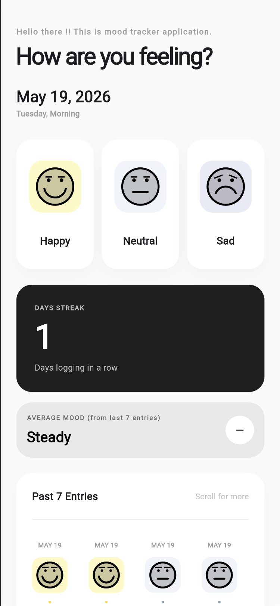
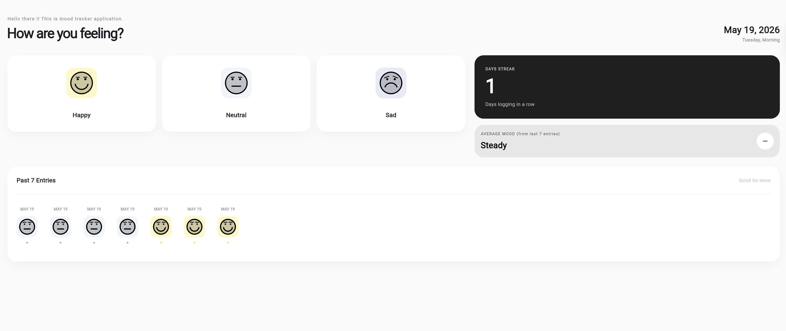

# Mood Tracker

A beautifully designed Flutter application to track, visualize, and reflect on your daily moods.

## Features

- **Dynamic Mood Visualizations:** Utilizes custom painters (`MoodFacePainter`) to render expressive and dynamic face representations of different moods (e.g., happy, neutral, sad).
- **Interactive UI:** Smooth animations, pagination, and intuitive design for an engaging user experience.
- **Firebase Integration:** Uses Firebase for backend services and data synchronization.

## Screenshots

<p align="center">
  
  
</p>

## Getting Started

To run this project locally, ensure you have Flutter installed.

```bash
# Clone the repository
git clone git@github-personal:arfuhad/mood-tracker.git

# Navigate into the project directory
cd mood_tracker

# Install dependencies
flutter pub get

# Run the app
flutter run
```

## Contributing

Feel free to open issues or submit pull requests if you want to help improve Mood Tracker!
